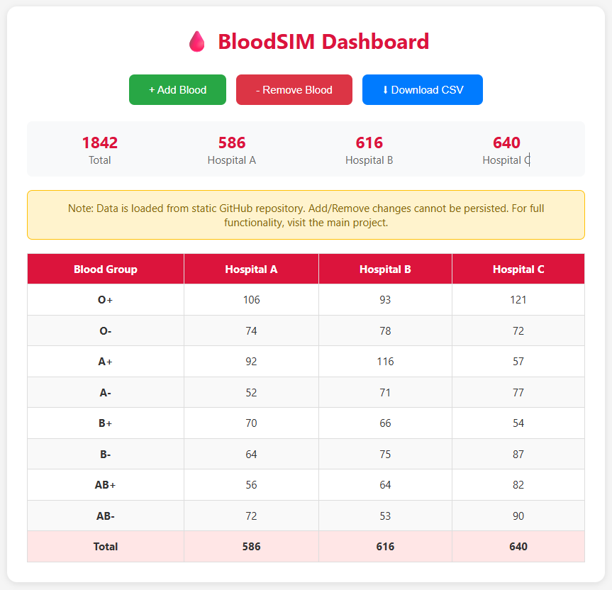

# BloodSIM UI



This is the frontend UI project for the BloodSIM simulation application.

## About

This repository contains only the user interface layer of the BloodSIM project. The main simulation logic and backend functionality are hosted in the main repository.

**Note:** This is a static UI deployed on GitHub Pages. Data is loaded from a JSON file in the repository. The Add/Remove buttons will show a success message but changes cannot be persisted. For full functionality with persistent data, visit the main project below.

## Main Project

For the complete application with full simulation logic, visit:
**https://github.com/nayaksomkar/BloodBSIM**

## Deployment

This UI is deployed via GitHub Pages at:
**https://nayaksomkar.github.io/BloodSIM.ui/**

## Tech Stack

- HTML5
- CSS3
- JavaScript (Vanilla)

## Local Development

Simply open `index.html` in your browser, or use a local server:

```bash
# Using Python
python -m http.server

# Using Node.js
npx serve
```